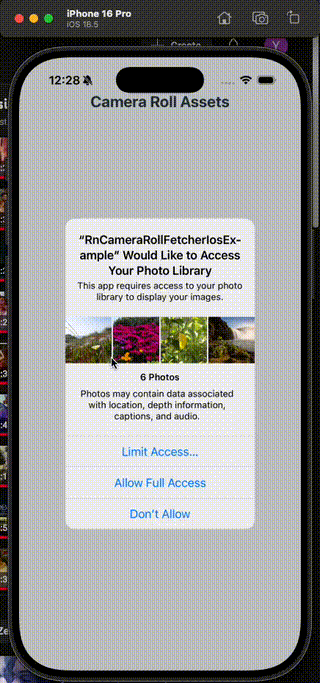

# rn-camera-roll-fetcher-ios

[](https://www.npmjs.com/package/rn-camera-roll-fetcher-ios)
[](https://www.npmjs.com/package/rn-camera-roll-fetcher-ios)
[](LICENSE)
[](#)
[](#)

A lightweight **React Native TurboModule** that converts iOS `ph://` asset URIs (from the Photos framework) into usable local file URIs (`file://`).  

This solves the common problem where iOS photo/video URIs are abstract and unusable for uploads, sharing, or processing.

---

## 🎥 Demo

<p align="center">
  
</p>

---

## 🎯 Why This Module Exists

On iOS, `ph://` URIs from Camera Roll or photo pickers are **not real file paths**.  
That means you can’t use them for:

- 🚫 Uploading to servers  
- 🚫 Image/video processing (requires `file://`)  
- 🚫 Sharing with other apps  
- 🚫 Direct file operations (reading/writing/metadata)  

✅ This module bridges that gap by converting `ph://` → `file://` with minimal effort.

---

## 📋 Requirements

- React Native **0.71+** (New Architecture recommended)  
- **iOS only** (Android returns the URI unchanged)

---

## 📦 Installation

```sh
npm install rn-camera-roll-fetcher-ios
# or
yarn add rn-camera-roll-fetcher-ios
# or
bun add rn-camera-roll-fetcher-ios
````

---

## 🚀 Quick Example

```js
import { getFileUri } from 'rn-camera-roll-fetcher-ios';

const uri = await getFileUri("ph://123...");
console.log(uri); 
// "file:///var/mobile/.../asset.jpg"
```

👉 For a complete upload example, see [Usage](#-usage).

---

## ❌ Before vs ✅ After

### Without this module:

```js
asset.uri = "ph://ED7AC36B.../001"
// ❌ Can't upload, can't process, not usable as file
```

### With `rn-camera-roll-fetcher-ios`:

```js
const fileUri = await getFileUri(asset.uri);
console.log(fileUri);
// ✅ "file:///var/mobile/.../tempAsset.jpg"
// Works for upload, processing, sharing, etc.
```

---

## 📖 Usage (Full Example)

```javascript
import { getFileUri } from 'rn-camera-roll-fetcher-ios';

// Example with @react-native-camera-roll/camera-roll
const handleAssetSelection = async (asset) => {
  try {
    const fileUri = await getFileUri(asset.node.image.uri);

    if (fileUri) {
      console.log('File URI:', fileUri);

      const formData = new FormData();
      formData.append('file', {
        uri: fileUri,
        type: 'image/jpeg',
        name: 'photo.jpg',
      });

      await fetch('https://your-api.com/upload', {
        method: 'POST',
        body: formData,
      });
    } else {
      console.log('Could not convert URI');
    }
  } catch (error) {
    console.error('Error converting URI:', error);
  }
};
```

---

## 🔧 API Reference

### `getFileUri(phUri: string): Promise<string | null>`

| Parameter | Type   | Description                            |
| --------- | ------ | -------------------------------------- |
| `phUri`   | string | iOS `ph://` URI (e.g., `ph://.../001`) |

**Returns:**
`Promise<string | null>`

* A usable `file://` URI if successful
* `null` if asset couldn’t be converted
* On non-iOS platforms: returns original URI unchanged

---

## ✨ Features

* ⚡ **TurboModule Architecture** → Fast, modern React Native integration
* 📖 **TypeScript Support** → Fully typed API
* 🎥 **Video + Image Support** → Works with both Photos & Videos
* 🗑 **Temporary File Management** → Cleans up temp storage automatically
* 🛡 **Graceful Error Handling** → Safe promise rejection

---

## 🛣 Roadmap

* [ ] Batch conversion for multiple assets
* [ ] Optional persistent storage instead of temp
* [ ] Swift-native implementation for better performance

---

## 🐛 Issues & Contributions

💡 Found a bug or want a feature?
Please open an issue on [GitHub](https://github.com/SolankiYogesh/rn-camera-roll-fetcher-ios/issues).
Contributions and pull requests are welcome! 🎉

---

## 📝 License

MIT © [SolankiYogesh](https://github.com/SolankiYogesh)

---

Made with ❤️ for the React Native community.
